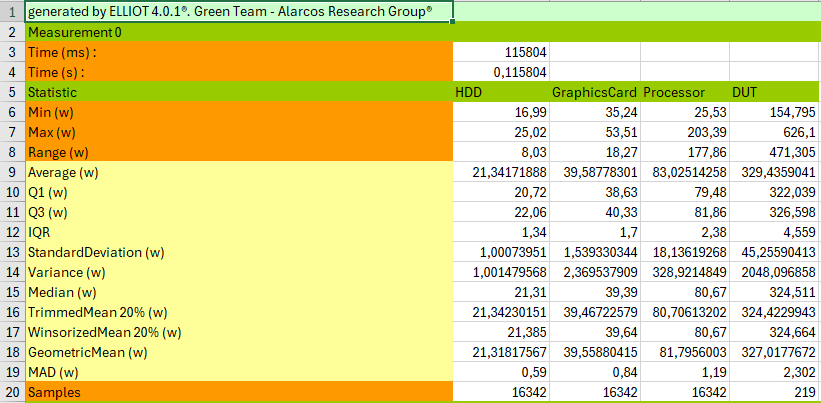
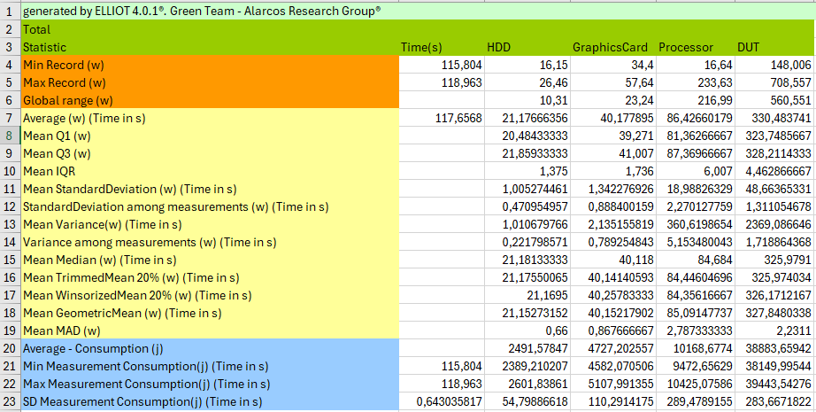
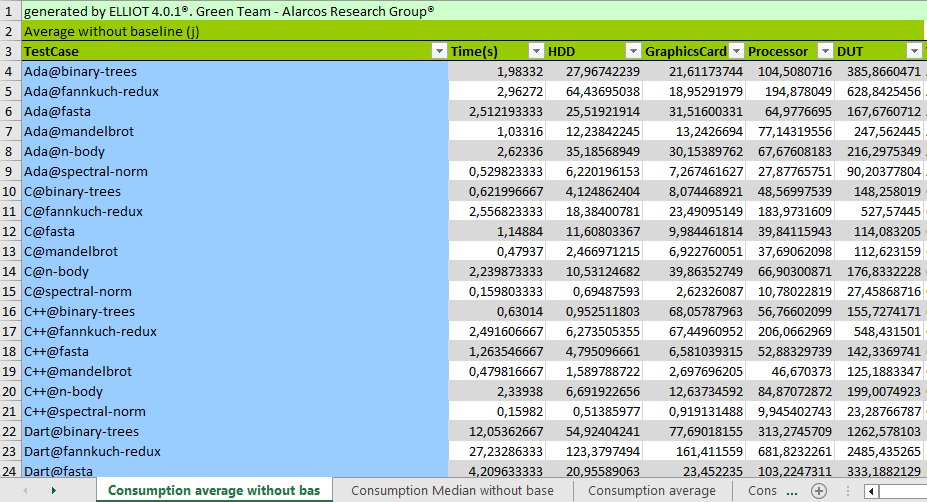
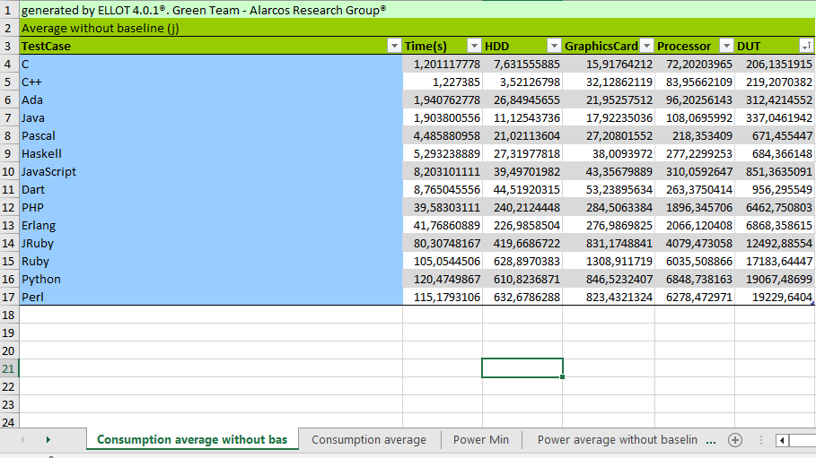
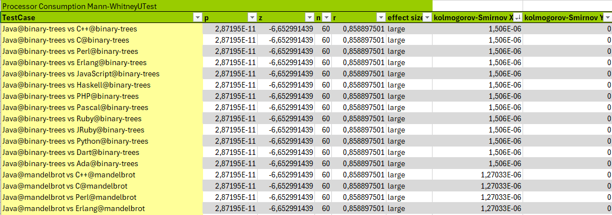

# Programming Languages Ranking based on Energy Measurements
[Alberto Gordillo](https://orcid.org/0000-0002-4742-173X)  

[Coral Calero](https://orcid.org/0000-0003-0728-4176)

[Mª Ángeles Moraga](https://orcid.org/0000-0001-9165-7144)

[Félix García](https://orcid.org/0000-0001-6460-0353)

[João Paulo Fernandes](https://orcid.org/0000-0003-0934-9244)

[Rui Abreu](https://orcid.org/0000-0002-7745-8015)

[João Saraiva](https://orcid.org/0000-0002-8891-8881)


## Abstract
This study builds upon the previous one carried out by [Pereira et al., 2021]( https://states.github.io/files/j2.pdf), in which 27 programming languages based on their energy efficiency were ranked under a software-based approach using RAPL software. The main motivation for this research is: 
1. Corroborate the already existing ranking by adding a new point of empirical evidence.
2. Assess the actual consumption of the PLs with a hardware-based approach versus the obtained previous study results which were based on estimations.
3. Delve deeper into the analysis of energy consumption of PLs, as it is essential to consider not only the overall consumption of each language but also various hardware components of interest, such as the processor, graphics card, and hard drive.

## What is this?

This repository contains the source code of 6 algorithms implemented in 14 programming languages, which were obtained from [Computer Language Benchmark Game](https://benchmarksgame-team.pages.debian.net/benchmarksgame/).
The repository also includes the resulting empirical results and some samples of the energy logs obtained from the hardware measuring instrument used in the study.

## How is structured?

This folder contains three main folders: code, empirical results and sample logs.

## Code Folder

The code folder contains 14 subfolders, one for each programming language, and a gen-input file to generate the input files needed to run some algorithms. It is structured as follows:

```Java

| <Programming Language-1>
	| <algorithm-1>
		| <source>
		| Makefile
	| ...
	| <algorithm-i>
		| <source>
		| Makefile
| ...
| <Programming Language-i>
	| <algorithm-1>
	| ...
	| <algorithm-i>
| gen-input.sh

```

Taking the `C` programming language as an example, this is how the folder for the `binary-trees` algorithm would look like:

```Java

| C
	| binary-trees
		| binarytrees.gcc-3.c
		| Makefile
	| ...

```

#### The Operations

Each algorithm sub-folder, included in a programming language folder, contains a `Makefile`.
TThis is the file which shows how to perform the 2 main operations: *(1)* **compilation** and *(2)* **execution**.

Basically, each `Makefile` **must** contain 2 rules, one for each operations:

| Rule | Description |
| -------- | -------- |
| `compile` | This rule specifies how the algorithm should be compiled in the language under consideration; Interpreted languages do not need it, so it can be left blank in these cases.
| `run` | This rule specifies how the algorithm should be executed; It is used to test whether the algorithm runs with no errors and the output is the expected. 

To illustrate this, an example of the `Makefile` for the `binary-trees` algorithm in the `C` language is:

```Makefile
compile:
	/usr/bin/gcc -pipe -Wall -O3 -fomit-frame-pointer -march=native -fopenmp -D_FILE_OFFSET_BITS=64 -I/usr/include/apr-1.0 binarytrees.gcc-3.c -o binarytrees.gcc-3.gcc_run -lapr-1 -lgomp -lm

run:
	./binarytrees.gcc-3.gcc_run 21

```
## Empirical Results Folder

The empirical results folder includes all the information on the analysis of the energy consumption of the software. The basic terminology used is as follows:
- An entity class corresponds to a programming language. 
- The test case is an algorithm implemented in a determined programming language.
- Measurement is each of the executions of a testcase.

It is structured as follows:

```Java
|<report>
	| <EntityClass-1>@<Algorithm-1>.xls
	| ...
	| <EntityClass-i>@<Algorithm-i>.xls
	| testcases_total.xls
	| testcases_comparison.xls
	| versions_total.xls
	| versions_comparison.xls
	| 
	| <clustering>
		| ...
		| <byalgoritms>
			| <source>
			| Makefile
		|
		| <bylanguage>
			| <source>
			| Makefile
        	|ClustersByLanguageAlgorithm.xls
        	|scriptR.txt
	| 
	| 
		| <EntityClass-1>@<Algorithm>_<Device-1>.png
		| ...
		| <EntityClass-i>@<Algorithm>_<Device-i>.png
		|
		| <EntityClass-1>@<Algorithm>_dut-1.png
		| ...
		| <EntityClass-i>@<Algorithm>_dut-i.png
|<comparisons>
	| <byParadigm>
		| ...
	| <byType>
		| ...
```
### Report Folder
The report folder contains 84 Excel files containing the analysis data. One for each test case named `<EntityClass>@<Algorithm>`. It also contains two files "testcases_total" and "versions_total" with the summary of the test case and version information respectively.
As an example, the following images show the information of a test case.

The first image shows all the information of a measurement.


The second image shows all the information of a test case.


To facilitate the comparison of information, the file "testcases_total" contains one sheet for each statistical value of all test cases. These statistical values are:
Consumption average without baseline, Consumption median without baseline, Consumption average (with baseline), Consumption median (with baseline), Baseline, Power min, Power average without baseline, Power average (with baseline), Power median without baseline, Power median (with baseline), Trimmed mean to 20%, Winsorized mean to 20%, Geometric mean, Mean standard deviation, Mean variance, Standard deviation among measurments and Variance among measurments



In the same way as the "testcase_total" document, the "versions_total" document contains the statistical values for each Entity Class.



Finally, the validation tests of the statistics can be found in testcases_comparison and versions-comparison. It contains the Kolmogorov-Smirnov and Mann-Whitney tests for all comparisons of time, power and consumption.



#### Clustering folder
Within the clustering folder there are two subfolders containing the cluster images for each algorithm and language. There is also the file ClustersByLanguageAlgorithm with the data to generate the clusters and scriptR.txt with the R code to generate them.

#### Img folder
The img folder contains the graphs of the overall consumption in the execution of each measurement performed. It also includes the box plots of each device for each test case.

### Comparisons folder
This folder contains the ranking tables by type and paradigm. This information has been obtained from the data in the versions_total file.

## Sample Logs Folder
This folder contains an example of a log, to illustrate the raw data generated by the EET measurement instrument. 
- The json file contains the measurement information of the entity class.
- Each line of LPsc++_490_EX are the values obtained for id, time, monitor and DUT
- Each line of LPsc++_490_IN are the values obtained for id, time, HDD(),HDD(2), Graphics card(1), Graphics card(2),Processor(1) and Processor(2).
DUT hardware components have two values because they have two sensors connected, the result of the DUT hardware component is the sum of the two values.

Note: The rest of the logs of this study are not included in the repository for practical reasons, due to their large size.

## Contacts and References

Previous study carried out by [Pereira et al., 2021]( https://states.github.io/files/j2.pdf)

[Green Team Alarcos](https://greenteamalarcos.uclm.es/)

[The Computer Language Benchmark Game](https://benchmarksgame-team.pages.debian.net/benchmarksgame/)

