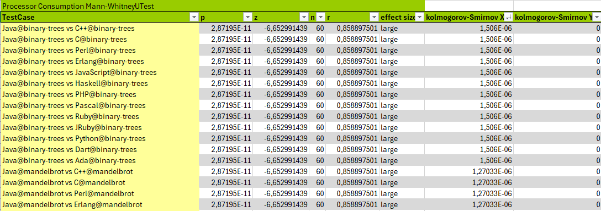

## Empirical Results Folder

The empirical results folder includes all the information on the analysis of the energy consumption of the software. The basic terminology used is as follows:
- An entity class corresponds to a programming language. 
- The test case is an algorithm implemented in a determined programming language.
- Measurement is each of the executions of a testcase.

It is structured as follows:

```Java
|<report>
	| <EntityClass-1>@<Algorithm-1>.xls
	| ...
	| <EntityClass-i>@<Algorithm-i>.xls
	| testcases_total.xls
	| testcases_comparison.xls
	| versions_total.xls
	| versions_comparison.xls
	| 
	| <clustering>
		| ...
		| <byalgoritms>
			| <source>
			| Makefile
		|
		| <bylanguage>
			| <source>
			| Makefile
        	|ClustersByLanguageAlgorithm.xls
        	|scriptR.txt
	| 
	| 
		| <EntityClass-1>@<Algorithm>_<Device-1>.png
		| ...
		| <EntityClass-i>@<Algorithm>_<Device-i>.png
		|
		| <EntityClass-1>@<Algorithm>_dut-1.png
		| ...
		| <EntityClass-i>@<Algorithm>_dut-i.png
|<comparisons>
	| <byParadigm>
		| ...
	| <byType>
		| ...
```
### Report Folder
The report folder contains 84 Excel files containing the analysis data. One for each test case named `<EntityClass>@<Algorithm>`. It also contains two files "testcases_total" and "versions_total" with the summary of the test case and version information respectively.
As an example, the following images show the information of a test case.

The first image shows all the information of a measurement.


The second image shows all the information of a test case.


To facilitate the comparison of information, the file "testcases_total" contains one sheet for each statistical value of all test cases. These statistical values are:
Consumption average without baseline, Consumption median without baseline, Consumption average (with baseline), Consumption median (with baseline), Baseline, Power min, Power average without baseline, Power average (with baseline), Power median without baseline, Power median (with baseline), Trimmed mean to 20%, Winsorized mean to 20%, Geometric mean, Mean standard deviation, Mean variance, Standard deviation among measurments and Variance among measurments


In the same way as the "testcase_total" document, the "versions_total" document contains the statistical values for each Entity Class.


Finally, the validation tests of the statistics can be found in testcases_comparison and versions-comparison. It contains the Kolmogorov-Smirnov and Mann-Whitney tests for all comparisons of time, power and consumption.



#### Clustering folder
Within the clustering folder there are two subfolders containing the cluster images for each algorithm and language. There is also the file ClustersByLanguageAlgorithm with the data to generate the clusters and scriptR.txt with the R code to generate them.

#### Img folder
The img folder contains the graphs of the overall consumption in the execution of each measurement performed. It also includes the box plots of each device for each test case.

### Comparisons folder
This folder contains the ranking tables by type and paradigm. This information has been obtained from the data in the versions_total file.
